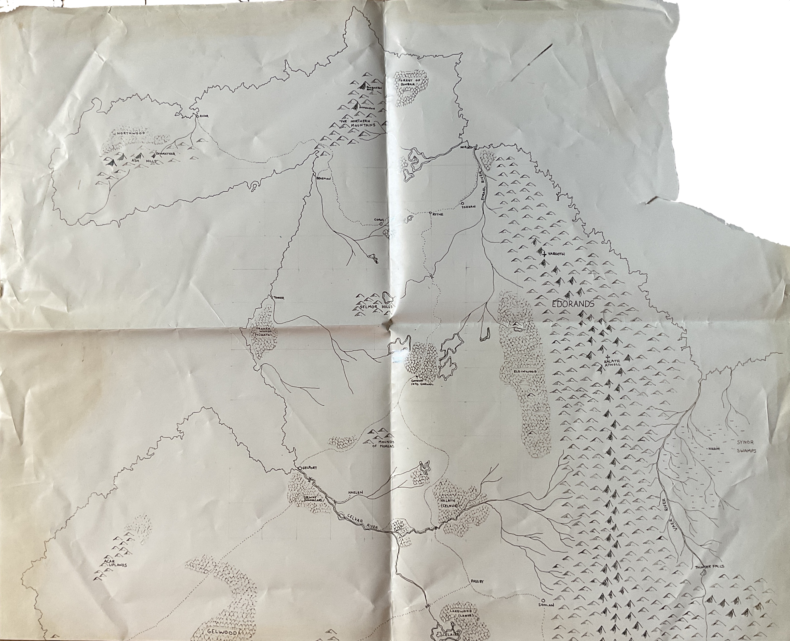
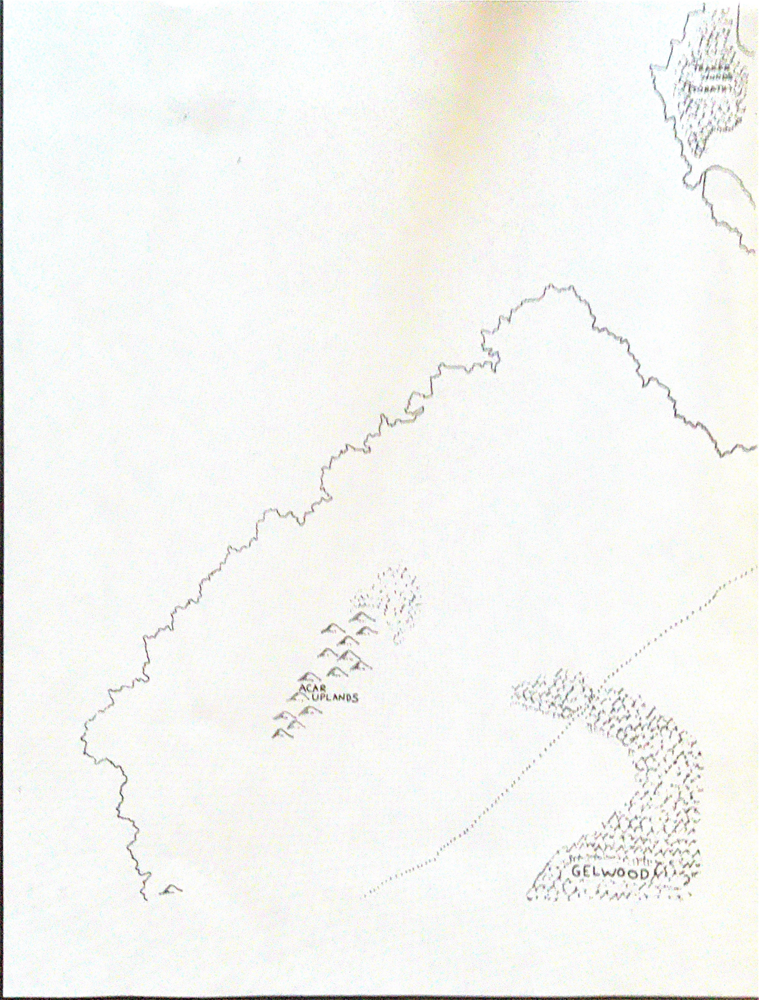
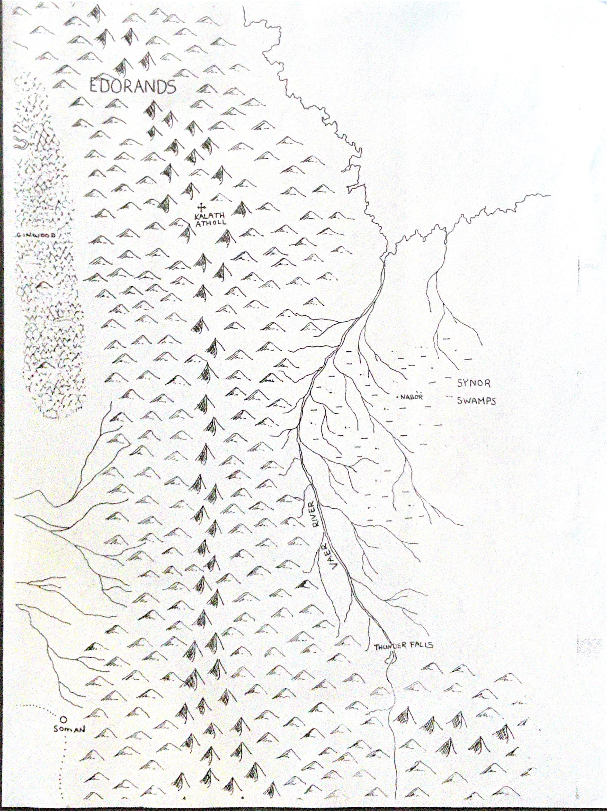
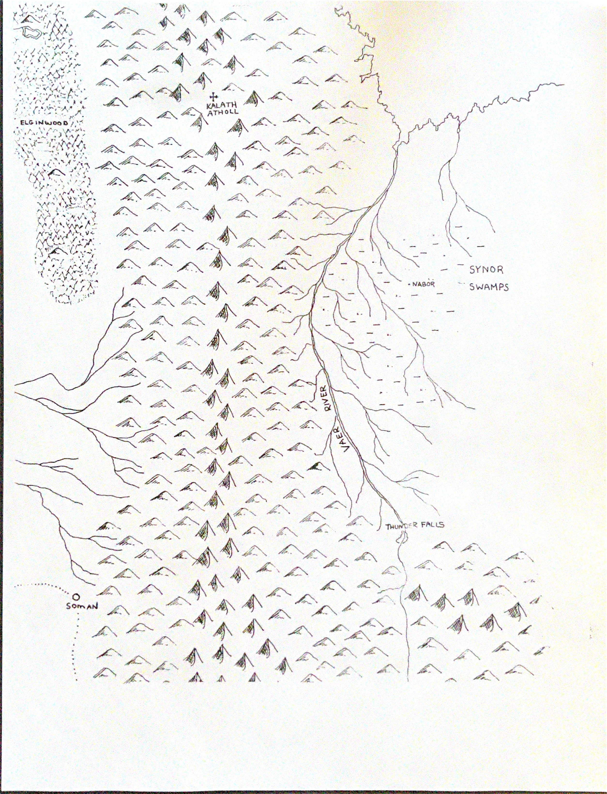
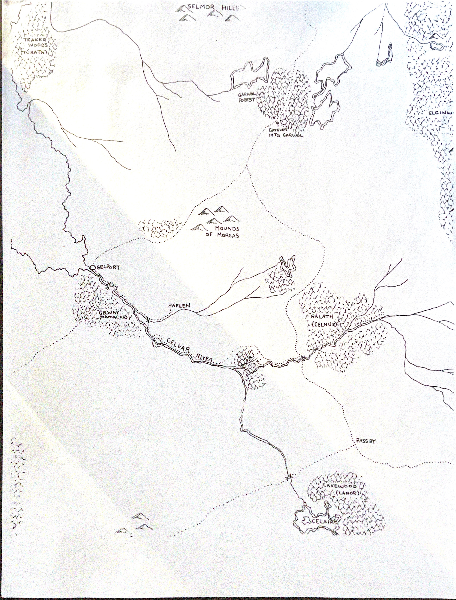
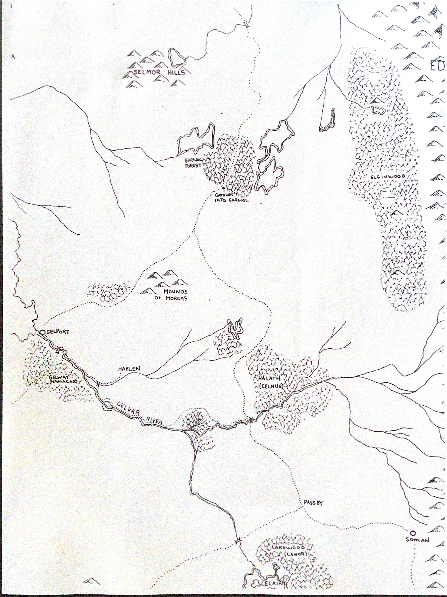
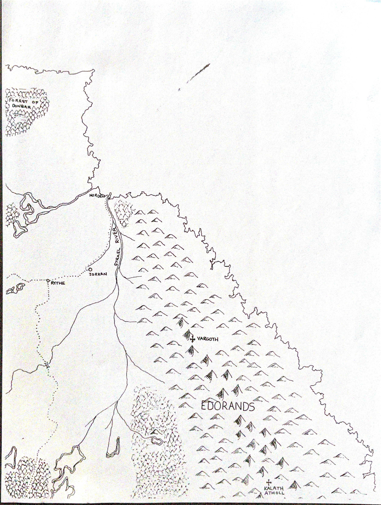
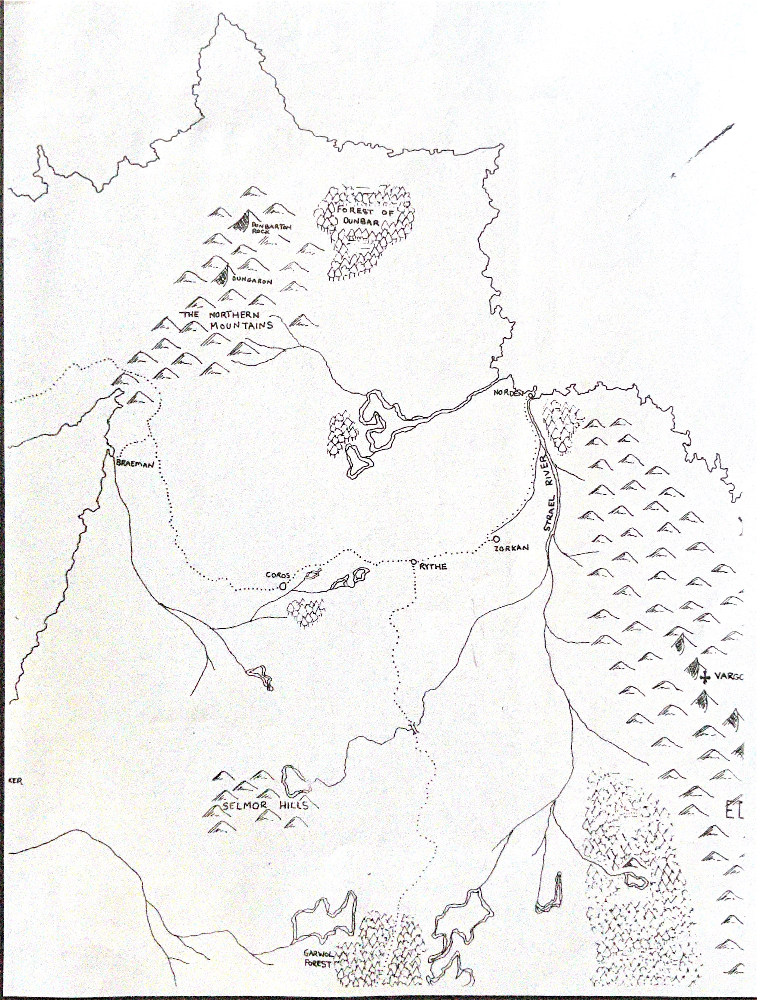
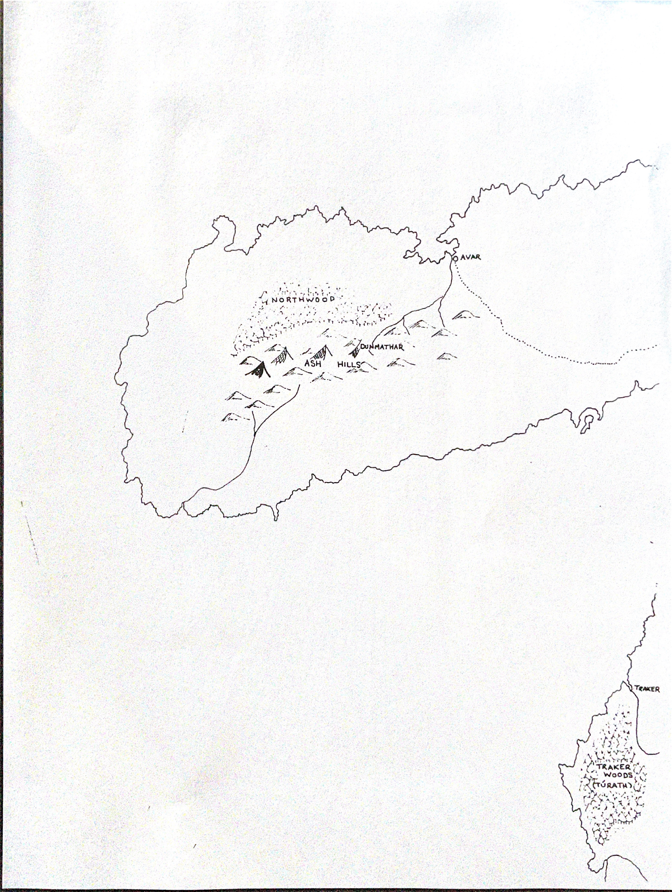

# Maps

Send me your mailing address so I can forward you copies of the Arthgar maps.

I don't have copies of the the lower half, neither does Cyril or Kevin, on hand. Cyril has a lot of his D&D stuff in storage
in NF at his sister's house, so I'm hoping that the next time he's down there he can have a poke through it. A lot of Kevin's
materials disappeared when he rented his house out the last time he was in Norwary. I'm not sure if Steve ever
had a copy of the maps anyway.

  I suspect that there may still be some copies in existance, because we did have many small single sheet sized pages.
Mom also claims that there is D&D stuff belonging to me is at home, but I have my doubts. Stilll, one never knows.

 

 

 

 

 

 

 

 

 
