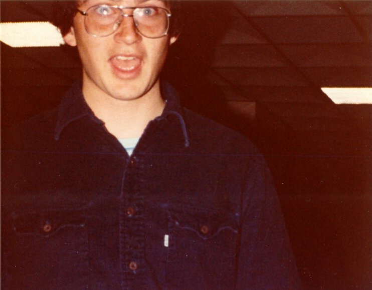
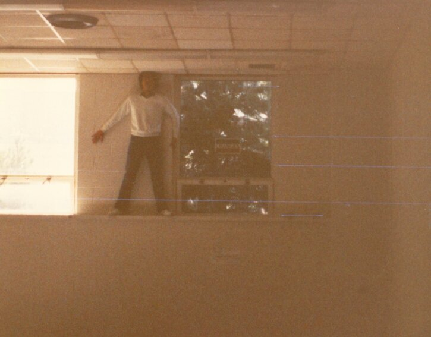
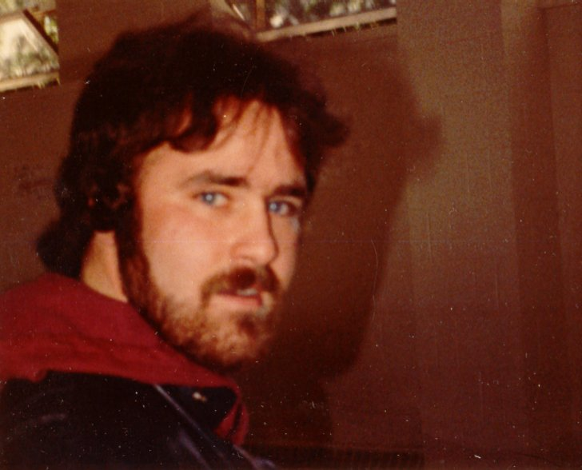
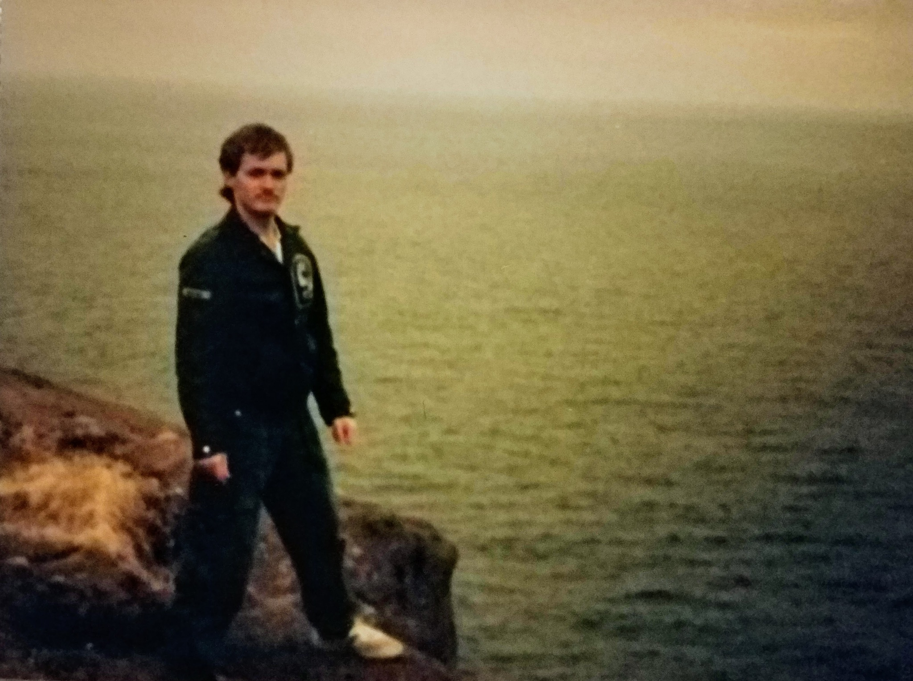
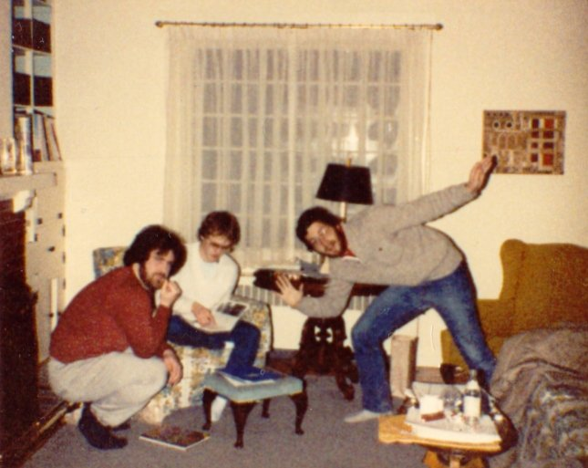
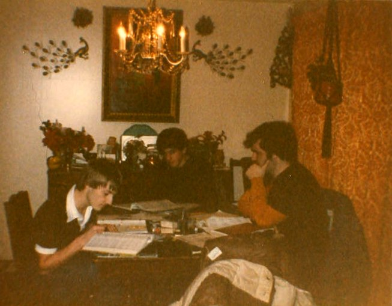
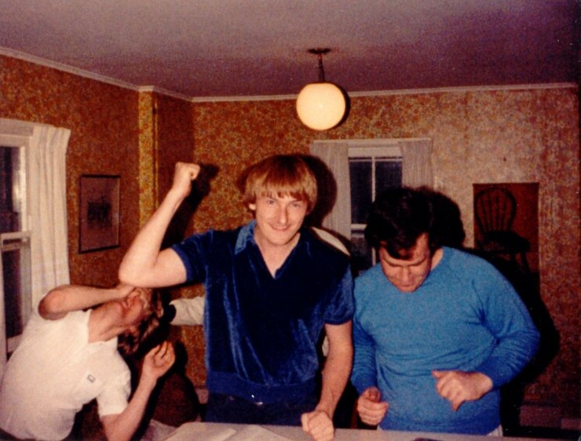
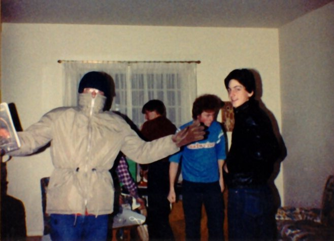
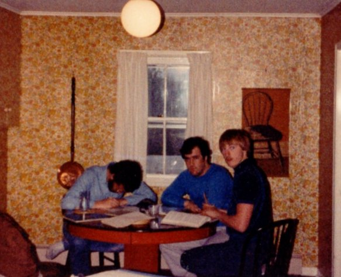

# Photos

Here's some photos of us playing D&amp;D. Yes, I know, what a bunch of geeks.
Click on the photos for a bigger version. These photos are all supplied by Steve Hart.

## People

 
Some anonymous geek who I've been told has much better taste in glasses now.

 
Craig Penny, a member of "the other group" contemplating his inevitable fate.

 
Cyril, "Yes I own a motorcycle, <i>and</i> I get my ammo for free".

 
Kevin, our DM

## Group Shots (from 1983)

 
Cyril, Kevin the DM, and me (sporting a beard). This is Steve's living room. 
In the corner is a record player (remember them?) with lots of great Monty Python vinyl.

 
John, Joe Healy (a sometimes player) and Cyril. 
This is in John's house.

 
Steve, John and Cyril. This is Steve's kitchen.

 
John (?) sporting someone's Player's Handbook, someone I don't recognize, a Level 0 Thief, and Joe.
This is Steve's living room again.

 
Myself (busily scribling), Cyril and John, in Steve's kitchen.

Last updated: 2002.11.04
